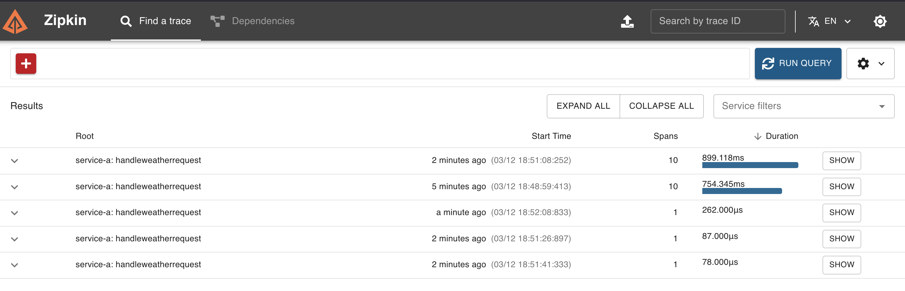
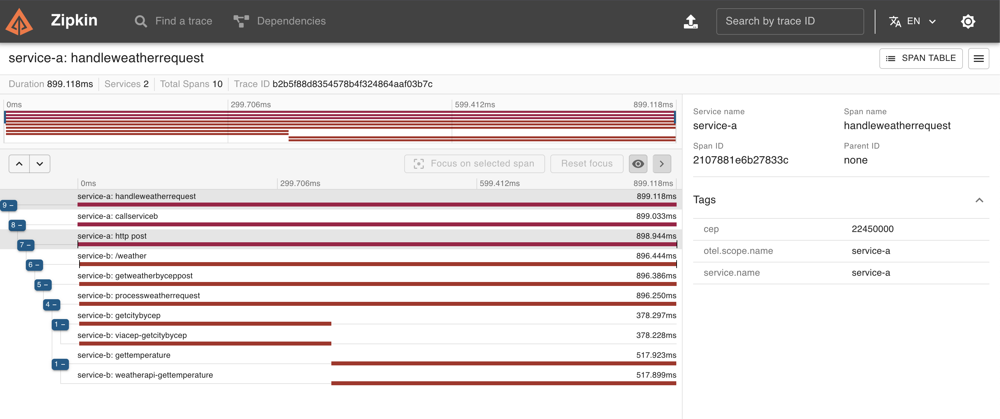

# Sistema de Temperatura por CEP com OpenTelemetry

Este projeto implementa um sistema distribuído composto por dois serviços que consultam a temperatura de uma cidade a partir de um CEP, com tracing distribuído usando OpenTelemetry e Zipkin.
    
## Arquitetura

- **Serviço A**: Recebe o CEP via endpoint POST, valida o formato e encaminha para o Serviço B
- **Serviço B**: Consulta o CEP via ViaCEP, obtém a cidade e consulta a temperatura via WeatherAPI
- **OpenTelemetry**: Implementa o tracing distribuído entre os serviços
- **Zipkin**: Utilizado para visualizar os traces
    
## Requisitos
    
- Docker e Docker Compose
- Chave de API da [WeatherAPI](https://www.weatherapi.com/)
    
## Como executar

1. Clone o repositório:
```bash
       git clone https://github.com/diillson/fullcycle-goexpert-desafio-temperature-for-cep.git
       cd fullcycle-goexpert-desafio-temperature-for-cep
```
2. Mude para a branch com suporte a OpenTelemetry e Zipkin:
```bash
git checkout feature/OTEL(Open-Telemetry)-e-Zipkin
```
>Nota: Esta branch contém a implementação completa do sistema distribuído com tracing usando OpenTelemetry e Zipkin. 

3. Configure sua chave da WeatherAPI no arquivo `docker-compose.yml` em `service-b > environment > WEATHER_API_KEY`
4. Inicie os serviços:

```bash
         docker-compose up -d
```

5. Acesse a aplicação:

- Serviço A (entrada): http://localhost:8080
- Serviço B (direto): http://localhost:8081
- Zipkin UI: http://localhost:9411
    
## Endpoints
    
### Serviço A
- **POST /weather**
- Corpo da requisição: `{ "cep": "12345678" }`
    
### Serviço B
- **GET /weather/{cep}**
- **POST /weather**
- Corpo da requisição: `{ "cep": "12345678" }`

## Usando CURL

Para fazer um curl para o Serviço A, você pode usar o seguinte comando:
```bash
    curl -X POST http://localhost:8080/weather \
      -H "Content-Type: application/json" \
      -d '{"cep": "01001000"}'
```

Este comando envia uma requisição POST para o endpoint  /weather  do Serviço A, que está rodando na porta 8080. O corpo da requisição é um JSON contendo o CEP a ser consultado.

Exemplo com um CEP válido (Zona Sul do Rio de Janeiro):
```bash
    curl -X POST http://localhost:8080/weather \
      -H "Content-Type: application/json" \
      -d '{"cep": "22450000"}'
```

Se quiser testar um CEP inválido para ver o tratamento de erro:
```bash
    curl -X POST http://localhost:8080/weather \
      -H "Content-Type: application/json" \
      -d '{"cep": "123"}'
```

Você receberá de volta o JSON com os dados de temperatura ou uma mensagem de erro apropriada, dependendo da validade do CEP.

## Visualizando Traces
    
Acesse o Zipkin em http://localhost:9411 para visualizar os traces gerados pela aplicação.
    
## Estrutura do Projeto

```bash
.
├── service-a/           # Implementação do Serviço A
├── service-b/           # Implementação do Serviço B
├── docker-compose.yml   # Configuração dos serviços
└── otel-collector-config.yaml  # Configuração do coletor OpenTelemetry
```

Esse conjunto de alterações implementa todos os requisitos pedidos:

1. Criado dois serviços separados (A e B)
2. O Serviço A recebe e valida o CEP através de um endpoint POST
3. O Serviço B processa a solicitação e retorna a temperatura
4. Implementamos OpenTelemetry com Zipkin para tracing distribuído
5. Adicionei spans para monitorar o tempo de resposta das requisições
6. Configurei docker e docker-compose para execução simplificada
7. Implementei tratamento de erros conforme solicitado

Para executar o sistema, basta configurar a API key da WeatherAPI no docker-compose.yml e executar  docker-compose up -d .

## Evidencia de funcionamento

### Tracing com Zipkin



